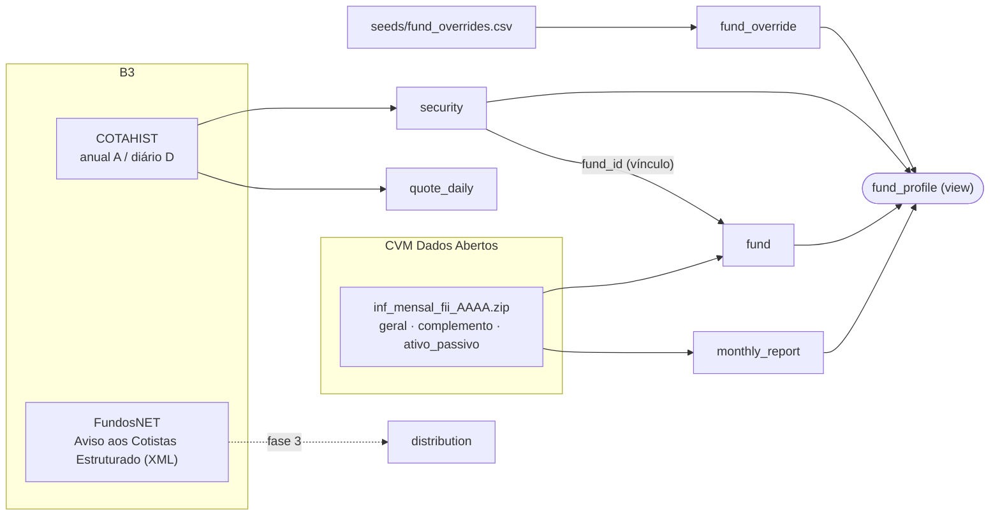

# Ingestão de dados

Como os dados chegam ao Postgres: fontes, tabelas, fluxo do `catch-up` e as armadilhas conhecidas de cada fonte.
O escopo atual é **somente FII**; Fiagro e FI-Infra virão depois (a coluna `fund.type` já existe).

## Visão geral

## Fontes → tabelas

| Tabela | Fonte | Conteúdo | Chave |
|---|---|---|---|
| `fund` | CVM, CSV `geral` | Cadastro: CNPJ, nome, ISIN informado, segmento declarado, administrador | `cnpj` |
| `monthly_report` | CVM, CSVs `complemento` + `ativo_passivo` | PL, VP/cota, cotistas, rentabilidade, DY do mês; composição do ativo em `raw` | `(fund_id, ref_month)` |
| `security` | B3 COTAHIST + vínculo calculado | Tickers negociados, ISIN, período de negociação, `fund_id` | `ticker` |
| `quote_daily` | B3 COTAHIST | OHLC, volume, nº de negócios por pregão (sem ajuste) | `(ticker, trade_date)` |
| `distribution` | B3 FundosNET (**fase 3**; só o parser existe) | Rendimentos e amortizações: data-com, pagamento, valor por cota | `(fnet_document_id, isin, kind)` |
| `fund_override` | `seeds/fund_overrides.csv` (manual) | Correções de categoria/segmento por ticker | `ticker` |
| `ingestion_run` | o próprio pipeline | Um registro por arquivo processado (hash, status, linhas) | — |
| `fund_profile` (view) | calculada | Categoria e segmento de cada fundo | — |

Descrições por coluna ficam no próprio banco (`\d+ <tabela>` no psql).

### URLs

| Fonte | URL | Atualização |
|---|---|---|
| CVM informe mensal | `https://dados.cvm.gov.br/dados/FII/DOC/INF_MENSAL/DADOS/inf_mensal_fii_{AAAA}.zip` | Semanal; os últimos ~5 anos são republicados com reenvios |
| COTAHIST anual | `https://bvmf.bmfbovespa.com.br/InstDados/SerHist/COTAHIST_A{AAAA}.ZIP` (~90 MB) | Diária durante o ano corrente |
| COTAHIST diário | `https://bvmf.bmfbovespa.com.br/InstDados/SerHist/COTAHIST_D{DDMMAAAA}.ZIP` (~400 KB) | Publicado à noite (~20h30) |
| FundosNET busca | `https://fnet.bmfbovespa.com.br/fnet/publico/pesquisarGerenciadorDocumentosDados` (`idCategoriaDocumento=14`, `idTipoDocumento=41`, `tipoFundo=1`) | Contínua |
| FundosNET documento | `https://fnet.bmfbovespa.com.br/fnet/publico/downloadDocumento?id={id}` | — |

Os endpoints do FundosNET não são uma API oficial e podem mudar.

## Fluxo do `catch-up`

`uv run fiidb catch-up` é idempotente e pode rodar no boot e diariamente. Em ordem:

1. **CVM**: para cada ano de `FIIDB_START_YEAR` (padrão 2016) até o atual, baixa o zip (~1 MB) e compara o sha256
   com a última execução bem-sucedida em `ingestion_run`. Se mudou, recarrega o ano inteiro numa transação.
2. **COTAHIST**:
   - anos fechados: arquivo anual, uma única vez (cacheado em `FIIDB_CACHE_DIR`, padrão `~/.cache/fiidb`);
   - ano corrente: arquivo anual na primeira vez, depois um arquivo diário por dia útil desde a última cotação.
     404 = feriado ou ainda não publicado (é tentado de novo na próxima execução).
3. **Vínculo ticker → fundo** (`fiidb/linking.py`), detalhado abaixo.
4. **Seeds**: substitui `fund_override` pelo conteúdo do CSV.

Cada arquivo é uma transação própria (conexão em autocommit + `conn.transaction()`). Falhas são registradas em
`ingestion_run` com `status = 'error'`, os demais arquivos seguem, e o comando sai com código 1.

Primeira carga: ~1 GB de download e alguns minutos. Execuções seguintes: segundos. Banco completo: ~200 MB.

## Regras de carga

- **Upsert via staging**: `db.upsert` faz `COPY` para uma tabela temporária e `INSERT ... ON CONFLICT`.
- **Versões da CVM**: dentro de um arquivo vale a maior `Versao` por (fundo, mês); no banco, uma linha só é
  sobrescrita por versão igual ou maior.
- **Cadastro**: um arquivo de ano antigo nunca sobrescreve dados de `fund` vindos de um informe mais recente.
- **`raw`**: toda coluna não modelada e não vazia vai para `monthly_report.raw` (texto), para não precisar
  baixar de novo quando quisermos um campo novo.

## Vínculo ticker → fundo

A CVM identifica fundos por CNPJ; a B3, por ticker. A ponte é o ISIN, mas o ISIN informado à CVM costuma vir
vazio, com erro de digitação ou de recibo de subscrição (`...R01M...`). Os métodos, do mais forte ao mais fraco
(um vínculo forte nunca é sobrescrito por um fraco):

| `link_method` | Regra |
|---|---|
| `fnet` | CNPJ + ISIN + ticker do aviso do FundosNET (**fase 3**) |
| `isin` | ISIN do COTAHIST = ISIN informado à CVM |
| `isin_issuer` | Mesmo código de emissor (caracteres 3–6 do ISIN, ex. `BR`**`HGLG`**`CTF004`) e só um fundo com ele |

Hoje ~45 tickers negociados ficam sem fundo; a fase 3 deve resolver a maioria.

## Classificação (`fund_profile`)

Calculada sobre a composição do ativo do informe mais recente que a tenha (`Total_Investido` > 0, que exclui a
liquidez):

| Regra | Categoria |
|---|---|
| ≥ 60% imóveis + sociedades imobiliárias, e > 50% disso para venda | Desenvolvimento |
| ≥ 60% imóveis + sociedades imobiliárias | Tijolo |
| ≥ 60% CRI, CRA, LCI, LCA, LIG, LH, debêntures, NP | Papel |
| ≥ 60% cotas de FII | FoF |
| nenhuma das anteriores | Híbrido |

O segmento declarado à CVM só é usado para Tijolo/Desenvolvimento e quando é específico (não "Multicategoria",
"Outros" ou "Títulos e Val. Mob."). `seeds/fund_overrides.csv` prevalece sobre tudo.

## Armadilhas conhecidas das fontes

| Fonte | Problema | Tratamento |
|---|---|---|
| CVM | Arquivos em latin-1, separador `;`, linhas CRLF | `decode("latin-1")` + `csv` |
| CVM | Colunas renomeadas em 2023 (RCVM 175): `CNPJ_Fundo` → `CNPJ_Fundo_Classe`, `Nome_Fundo` → `Nome_Fundo_Classe` | `RENAMES` em `cvm_fii.py` |
| CVM | ~1% dos informes com proporções absurdas (rentabilidade de 10 bilhões no mês) | `\|ratio\| > 1` vira NULL; original fica em `raw`; colunas `numeric` sem limite |
| CVM | Segmento declarado grosseiro (maioria "Multicategoria") | Classificação própria + overrides |
| CVM | ISIN vazio ou errado | Vínculo em camadas |
| B3 | FIIs no BDI 12, mas Fiagro/FI-Infra no BDI 14 junto com ETFs e FIPs | Hoje só BDI 12; o tipo virá da CVM, não da B3 |
| B3 | Preços não ajustados por proventos/desdobramentos | Guardados como negociados; ajuste será calculado |
| B3 | Arquivo diário só sai à noite | 404 é normal; tentado de novo no próximo `catch-up` |

## Testes

- `uv run pytest`: parsers, com fixtures reais em `pipeline/tests/fixtures/`.
- Com `FIIDB_TEST_DATABASE_URL` apontando para um banco descartável, também os testes de carga
  (`tests/test_load.py`). Eles **apagam o schema `public`** desse banco e aplicam `db/migrations`.
